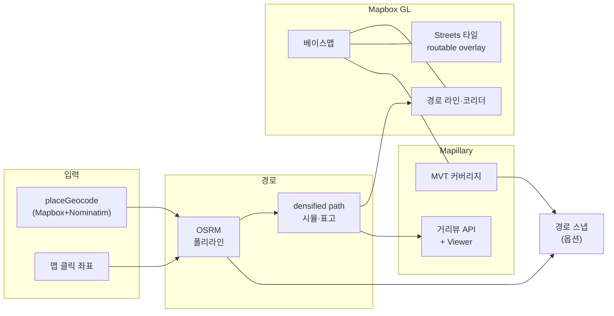

# Mapbox · OSRM · Mapillary 역할 및 경로·커버리지 구분 정리

**작성일:** 2026-05-11  
**파일 접두어:** `260511-`  
**범위:** Ride the World - Indoor Cycling 코드베이스(`App.tsx`, `services/*`, Mapbox GL 레이어) 기준 — 세 외부 서비스의 기능 분담, 지도 위에 겹쳐지는 “커버리지” 종류와 특성, 서비스 내 역할을 한 문서로 정리한다.

---

## 1. 한눈에 보는 역할 분담

| 서비스 | 앱에서의 핵심 역할 | 주요 진입점(코드·모듈) |
|--------|-------------------|-------------------------|
| **Mapbox** | 베이스맵 렌더링(Mapbox GL), 지오코딩(정·역), 주행 경로 GeoJSON 라인·코리더, **주행 가능 도로 벡터 타일** 오버레이, 3D 지형/건물(옵션), 저작권·토큰 | `mapbox-gl`, `mapboxRouteLayer.ts`, `placeGeocode.ts`, `mapboxForwardGeocode.ts`, `mapboxReverseGeocode.ts`, `App.tsx`(맵 초기화·레이어) |
| **OSRM** | 출발·도착·경유지 간 **실제 라우팅**(자전거·도보·차량 프로필), 폴리라인 기반 거리·기본 duration, 스냅 반경(100m→300m 완화) | `services/osrmRoute.ts`, `api/osrm-route.js`, `App.tsx` `calculateRoute` 흐름 |
| **Mapillary** | **촬영 경로 커버리지**(벡터 타일), **거리뷰 이미지**(Graph API·타일·JS Viewer), 경로와의 공간 매칭·주행 동기화 | `services/mapillaryCoverage.ts`, `services/mapillaryStreetView.ts`, `MapillaryRideViewer.tsx`, `services/mapillaryRouteSnap.ts`, `App.tsx` |

세 서비스는 **서로 다른 데이터 원천**을 쓴다. 같은 도로 위를 그린 것처럼 보여도, “OSRM이 통과 허용한 경로”, “Mapbox 타일에 나온 도로 클래스”, “Mapillary가 실제 촬영한 선”은 **동일하지 않을 수 있다.**

---

## 2. Mapbox — 역할·기능 상세

### 2.1 맵 표현

- **스타일:** Streets / Outdoors / Satellite / Hybrid 등 (`mapStyleUrl` → Mapbox 호스트 스타일 URL).
- **렌더링 엔진:** Mapbox GL JS — 벡터·래스터 타일 합성, 줌·회전·틸트.

### 2.2 지오코딩(장소 검색·역지오코딩)

- **정지오코딩:** `placeGeocode.ts` — Mapbox Geocoding API 우선, 실패·타임아웃 시 Nominatim 폴백. 상단 장소 검색·출발/도착 자동완성·주소→좌표(`addressToCoord`)에 사용.
- **역지오코딩:** Mapbox Reverse 우선, 폴백 Nominatim — 맵 클릭 후 주소 문자열 보강(`resolveNearestAddress`) 등.

### 2.3 경로 시각화(GeoJSON)

- **`cycle-route-src`:** OSRM으로 계산·복원된 경로 좌표열.
- **`cycle-route-line` (`ROUTE_LAYER`):** 좁은 **빨간 라인** — 사용자에게 보이는 “현재 계산된 경로”.
- **`cycle-route-corridor` (`ROUTE_CORRIDOR_LAYER`):** 동일 선형을 넓게 칠한 **파란 반투명 코리더** — 경로 구간 강조(토글 가능). 주석상 Street View 커버리지와 **별개**이며, **실제 탐색 결과 선**과 동일 소스를 공유한다.

### 2.4 “OSRM/맵 도로” 오버레이 (주행 가능 도로 네트워크 표시)

- **소스:** `cycle-routable-roads-src` → 타일셋 `mapbox://mapbox.mapbox-streets-v8`.
- **레이어:** `routable-roads-overlay` — `road` 소스 레이어에서 특정 **도로 클래스**(motorway, primary, cycleway 등)만 필터링한 **시안 라인**.
- **역할:** 앱 UI에서는 “OSRM 맵 도로” 등으로 안내되지만, 데이터적으로는 **Mapbox Streets(OSM 등을 반영한 상품 타일)** 위의 네트워크 표현이다. OSRM 엔진 그래프와 **1:1 대응이 아니다**.
- **위성 단독 스타일:** 과거에는 벡터 소스 부재로 오버레이가 안 보일 수 있어, 현재는 **별도 Streets 타일셋 소스**를 붙여 표시하는 방향으로 보완됨(`App.tsx` 주석·로직 참고).

### 2.5 기타

- **지형/3D:** Terrain RGB, 건물 익스트루전(옵션).
- **토큰:** `VITE_MAPBOX_ACCESS_TOKEN` — 맵·지오코딩·Mapbox 타일 요청에 공통 사용.

---

## 3. OSRM — 역할·기능 상세

### 3.1 라우팅

- **역할:** 사용자가 고른 출발·도착·경유지(좌표 또는 지오코딩 결과)를 입력으로 **도로 네트워크 상 최단/최적 유사 경로**를 계산.
- **엔드포인트:** 기본 `routing.openstreetmap.de`의 `routed-car` / `routed-bike` / `routed-foot`; 일시 오류 시 `router.project-osrm.org` 폴백(`osrmRoute.ts`).
- **스냅:** 각 웨이포인트마다 반경 **100m**; `NoSegment` 시 **300m**로 한 번 완화 재시도.

### 3.2 산출물

- **인코딩 폴리라인 → 디코딩 좌표열** — 앱에서 일정 간격으로 densify하여 시뮬레이션·표고 샘플링·Mapillary 샘플링에 사용.
- **거리·duration:** OSRM 응답의 `distance`/`duration`은 저장·디버그 등에 쓰이고, UI ETA 등은 **사용자 설정 평균 속도 기반**으로 재계산되는 부분이 있다(주석 참고).

### 3.3 저장·오프라인

- `fullGeometry`, densified 경로, 표고 시퀀스를 저장해 **OSRM 재호출 없이** 주행 복원하는 경로가 있다(`USE_OFFLINE_ROUTE_RESTORE` 등).

---

## 4. Mapillary — 역할·기능 상세

### 4.1 커버리지 벡터 타일(MVT)

- **소스:** `tiles.mapillary.com` … `mly1_public` — `sequence` 레이어.
- **레이어 1 — 일반 시퀀스 (`mapillary-sequence-lines`):** 촬영 차량/트레일 경로. **주황** 라인, 줌에 따라 두께 보간.
- **레이어 2 — 파노 구간 (`mapillary-pano-sequence-lines`):** `is_pano` 필터 — **360°** 구간 강조, **시안** 계열·별도 토글.
- **독립 토글:** 기본 커버리지 / 360° 커버리지를 UI에서 각각 on/off.

### 4.2 거리뷰(이미지)

- **Graph API 등:** 경로 주변·샘플 지점에서 이미지 후보 조회(`mapillaryStreetView.ts` 등).
- **주행 중 패널:** 경로 상 위치와 전방 방향을 반영해 후보 선정·전환(`chooseMapillaryPickAlongPath`, 쓰로틀·세대 번호로 레이스 방지).
- **뷰어:** `MapillaryRideViewer` — Mapillary JS SDK 기반, iframe 단발보다 연속 `moveTo` 전환에 초점.

### 4.3 경로와의 결합

- **라우트 스냅 옵션:** OSRM 웨이포인트 체인을 Mapillary 커버리지에 맞추는 병렬 스냅(`mapillaryRouteSnap.ts`) — 커버리지 토글 상태를 넘겨 **일반/파노** 가중을 반영할 수 있음.

### 4.4 토큰

- `VITE_MAPILLARY_CLIENT_TOKEN` — 타일·API·뷰어 접근에 필요(미설정 시 커버리지·거리뷰 관련 기능 비활성 또는 제한).

---

## 5. “경로 커버리지” 구분 — 종류·특성·서비스 내 역할

아래는 지도 위·라우팅 파이프라인에서 혼동되기 쉬운 개념을 **이름으로 분리**한 것이다.

| 구분 | 데이터 원천 | 지도·UI에서의 표현 | 특성 | 이 서비스에서의 역할 |
|------|-------------|-------------------|------|---------------------|
| **A. OSRM 탐색 경로** | OSRM 라우팅 그래프 | 좁은 빨간 라인 (`ROUTE_LAYER`) | **실제로 계산된 한 줄의 경로**; 거리·코칭·시뮬 인덱스의 기준 | 핵심 라이드 경로 |
| **B. 경로 코리더** | A와 동일 GeoJSON | 넓은 파란 반투명 (`ROUTE_CORRIDOR_LAYER`) | 시각적 강조만; 네트워크 전체가 아님 | “이번에 탄 코스” 가시성 |
| **C. 주행 가능 도로 오버레이** | Mapbox **Mapbox Streets v8** 타일 | 시안 도로 넷 (`routable-roads-overlay`) | OSM 기반 상품 타일의 도로 클래스 하이라이트; **OSRM 결과와 불일치 가능** | 도로 네트워크 참고·OSRM과의 대략적 비교 |
| **D. Mapillary 일반 커버리지** | Mapillary **촬영 시퀀스** MVT | 주황 선 (`mapillary-sequence-lines`) | **이미지가 존재하는 촬영 경로** | 거리뷰 가능 구간 파악 |
| **E. Mapillary 360° 커버리지** | 동일 MVT + `is_pano` | 시안 선 (`mapillary-pano-sequence-lines`) | 파노 전용 구간 강조 | 360 뷰 UX·후보 필터 |
| **F. 지오코딩 결과** | Mapbox(+폴백 Nominatim) | 마커·출발도착 문자열 | 좌표 해석; 레이어 아님 | 검색·입력→좌표 |

**정리:** “커버리지”라는 말이 없는 공식 용어는 아니지만, 앱에서는 **A/B = 이번 라우트**, **C = 맵상 도로망 참조**, **D/E = 거리뷰 가능 구간**, **F = 주소↔좌표** 로 나누는 것이 구현·설명 모두에 맞다.

---

## 6. 레이어 스택(개략)

바닥에서 위로 올라갈수록 위에 그려진다(실제 순서는 스타일·`moveLayer`에 따름).

1. Mapbox 베이스맵(래스터·벡터 스타일 본체)  
2. **Mapillary 시퀀스·파노 커버리지** — `stackMapillaryBelowRoutableRoads`로 **시안 주행가능 도로 오버레이 아래**에 두어, “도로 네트워크 표시가 커버리지보다 위”가 되도록 함  
3. **주행 가능 도로 오버레이** (`routable-roads-overlay`)  
4. **경로 코리더**(켜진 경우)  
5. **메인 경로 라인** (`ROUTE_LAYER`)  
6. 마커·HUD 등

---

## 7. 상호 의존 관계(요약 다이어그램)

---

## 8. 참고·준수 사항

- 각 서비스 **이용약관·표시 의무·쿼터**를 준수해야 한다. 맵 attribution은 Mapbox/Mapillary/OpenStreetMap 등 스타일·레이어에 맞게 표시된다.
- 본 문서는 특정 시점 코드 기준이며, 엔드포인트·타일 URL·토글 이름은 변경될 수 있다.

---

**문서 끝.**
