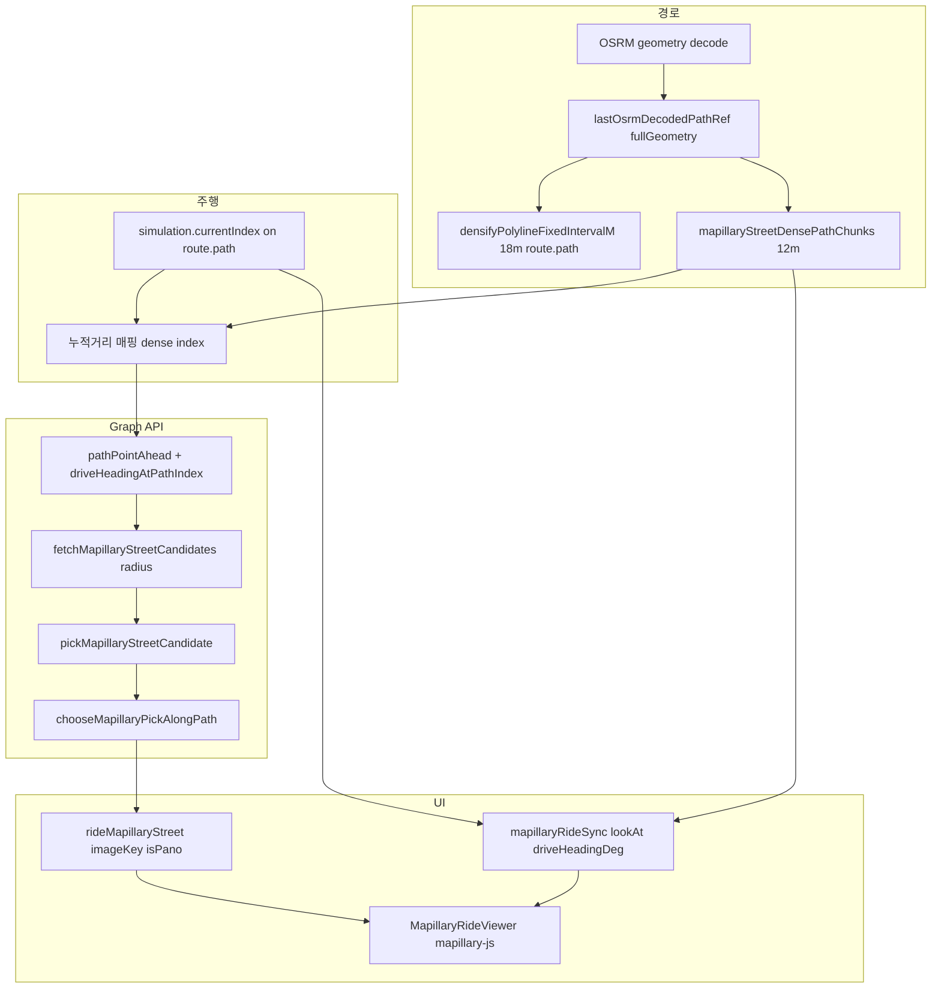

# Mapillary 거리뷰 표시·품질·UX 진행 보고서

**파일 접두어:** `260511-`  
**작성일:** 2026-05-11  
**범위:** 실내 사이클 앱에서 OSRM 주행 경로와 연동되는 Mapillary 기반 거리뷰(Street View) — 데이터 파이프라인, 후보 선정, 뷰어 동기화, 운영 UX까지 코드 기준으로 정리한다.

---

## 1. 목표 정리

| 구분 | 목표 |
|------|------|
| **표시** | 주행 중 현재 위치·전방과 맞는 Mapillary 이미지를 안정적으로 찾아 플로팅 패널에 표시한다. |
| **품질** | 옆 도로·역방향·먼 키프레임으로의 “튐”을 줄이고, 시야가 주행 방향과 최대한 일치한다. |
| **UX** | 과도한 API 호출·화면 깜빡임·불필요한 패널 닫힘을 피하고, 사용자 제어(닫기, 커버리지 토글)와 일시정지 동작이 자연스럽다. |

---

## 2. 거리뷰가 화면에 오르기까지의 과정(파이프라인)

아래는 현재 구현 기준 end-to-end 흐름이다.

1. **경로 수립**  
   - OSRM 응답 geometry를 디코드해 `lastOsrmDecodedPathRef`에 원본 폴리라인(`[lat,lng][]`)을 보관한다.  
   - 맵·시뮬레이션·저장용으로 `densifyPolylineFixedIntervalM(..., ROUTE_RENDER_DENSIFY_INTERVAL_M)` (현재 18m)로 `route.path`를 만든다.  
   - 거리뷰 전용으로는 동일 원본에 대해 더 촘촘한 간격(`MAPILLARY_QUERY_PATH_INTERVAL_M`, 현재 12m)으로 `mapillaryStreetDensePathChunks`를 `useMemo`로 유지한다.

2. **주행 인덱스와 샘플 경로 정렬**  
   - 시뮬레이션은 여전히 **희소** `route.path`의 `currentIndex`로 진행한다.  
   - Graph 조회 시에는 희소 꼭짓점까지의 누적 거리(`cumSparse`)를 구하고, `indexAtOrBeforeCumulativeDistance`로 **촘촘 경로** 상의 시작 인덱스(`queryIdx`)를 맞춘 뒤, `queryMapillaryAlongPathSamples`에 촘촘 경로를 넘긴다.

3. **폴링·스로틀**  
   - `simulation.currentIndex`를 effect 의존성에 넣지 않기 위해 `simulationIndexForStreetRef`와 짧은 interval 폴링을 사용한다(매 틱 effect cleanup 으로 fetch 가 끊기는 문제 방지).  
   - `MAPILLARY_STREET_FETCH_MIN_MOVE_M`, `MAPILLARY_STREET_FETCH_THROTTLE_MS`로 이동·시간 기준을 두어 호출 빈도를 제한한다.

4. **전방 다점 샘플링**  
   - `MAPILLARY_STREET_LOOKAHEAD_SAMPLES_DENSE_M`: 현재 위치부터 0~300m 구간을 촘촘한 거리 격자로 나누어, 각 지점에서 Graph `images` 검색을 병렬로 수행한다.

5. **후보 선정**  
   - 각 지점: 반경 내 후보 → `pickMapillaryStreetCandidate`(거리·전방 정렬·compass 가중) → 전 구간 결과를 `chooseMapillaryPickAlongPath`로 한 장면으로 압축(연속성·envelope·dismissed 처리).

6. **상태·뷰어**  
   - `rideMapillaryStreet`: `imageKey`, `shownAtMs`, `isPano` 등.  
   - `MapillaryRideViewer`: `mapillary-js` `Viewer`, `moveTo`로 이미지 전환, `lookAt` / `driveHeadingDeg`로 시야 동기화.

7. **맵·라우팅 보조**  
   - 토큰이 있을 때 출발지 체인을 `snapRoutingChainToMapillaryParallel`로 보정해 OSRM 요청 좌표를 커버리지에 맞출 수 있다.  
   - Mapbox 상에 Mapillary 시퀀스 커버리지 레이어(일반/360) 토글로 “어디에 촬영이 있는지” 시각적 맥락을 제공한다.

---

## 3. 품질·UX를 위해 진행한 작업(테마별)

### 3.1 경로 기하: 샘플이 도로에서 벗어나지 않도록

**문제 인식**  
세그먼트마다 `computeHeading` + `computeOffset`으로 직선 구대상 보간하면, OSRM 꼭짓점 사이의 실제 도로 곡선과 어긋난 가상 좌표가 생길 수 있고, 그 지점에서 nearest 이미지 검색 시 **옆 도로·평행도로** 후보가 섞이기 쉽다.

**적용**  
- `services/geoUtils.ts`의 `densifyPolylineFixedIntervalM`: 폴리라인 **누적 Haversine 거리**를 따라 일정 간격으로 점을 찍고, 세그먼트 내부는 **위도·경도 선형 보간**(`getLatLngAtDistanceAlongPath`와 동일 기준).  
- `services/mapillaryStreetView.ts`의 `pathPointAhead`: 세그먼트 잔여 구간에서도 `computeOffset` 대신 **선분 비율 `t`** 보간.

**렌더 vs 거리뷰 샘플 분리**  
- 렌더·시뮬: 약 18m 간격으로 점 수와 연산을 줄인다.  
- 거리뷰 Graph 질의: 원본(`lastOsrmDecodedPathRef`) 기준 약 12m 촘촘 경로 — **표시용 경로와 질의용 경로를 분리**해 품질과 부하의 절충을 맞춘다.

### 3.2 Graph 검색: 반경·방위·시퀀스

**반경**  
- 과거 50m 고정 등은 옆 도로 후보를 끌어오기 쉬움.  
- `mapillaryStreetSearchRadiusM(speedKmH)`: 대략 저속 16m / 그 외 28m, **10~50m 클램프**. `queryMapillaryAlongPathSamples`에 `effectiveSpeedKmH`를 넘겨 동적으로 반경을 쓴다.

**방위(compass) 필터**  
- `pickMapillaryStreetCandidate`에서 `computed_compass_angle` / `compass_angle`이 있는 후보만으로 **진행 방위와 45° 이내**인 집합을 우선 사용(`MAX_HEADING_DIFF_DEG`).  
- 해당 집합이 비면 compass 보유 전체 → 그것도 없으면 전체 후보로 완화해 “아예 못 고르는” 상황을 줄인다.  
- 점수식에서 `facingAlign` 가중을 소폭 상향해 촬영 방향 일치를 강조한다.

**시퀀스 연속성**  
- Graph `fields`에 `sequence`를 요청해 `sequenceId`를 후보에 실음.  
- `chooseMapillaryPickAlongPath`의 점수에서 이전 픽과 **같은 sequence**이면 보너스(페널티 감소)를 줘 A도로↔B도로 왕복 같은 점프를 완화한다.

### 3.3 전방 샘플 묶음에서 “한 장” 고르기

**`chooseMapillaryPickAlongPath` 요지**  
- 가장 가까운 샘플 히트 주변 **envelope**(현재 `ALONG_PATH_ENVELOPE_M` 48m) 밖으로만 먼 전방 샘플이 있을 때의 큰 점프를 막는다.  
- 이전 촬영점과의 거리에 따른 **jumpPenalty**, 동일 `id` 보너스, 사용자가 닫은 `dismissedId` 우선 제외.  
- 라이더가 이전 픽에서 멀어지면(`stalePrevRiderDistM`) 연속성 가중을 끈다.

### 3.4 뷰어(mapillary-js) 쪽 품질

**전환**  
- `TransitionMode.Instantaneous`로 컷 전환 통일(모션·블렌드에 따른 체감 들쭉날쭉함 완화).  
- UI 컴포넌트: `direction`·`sequence` 컨트롤 등 불필요 요소 비표시.

**시야 정렬**  
- 우선 `project(lookAt)` → `unprojectToBasic` → `setCenter`: **전방 GPS점을 화면 중심에 맞추는** 공간 정렬.  
- 실패 시에만 360(`sphericalNavigation`)에서 bearing 기반 UV 보정.  
- Basic 이미지에서 equirectangular Y가 극단일 때 `softenBasicYTowardHorizon`으로 지평선 대역에 가깝게 당김(하늘·발밋만 보는 완화).  
- `full` vs `bearingDrift` 모드: 같은 파노 안 재정렬은 덜 자주·덜 민감하게(`REALIGN_*` 상수, debounce).  
- `HEADING_SMOOTH_ALPHA`로 주행 방위 저역 통과 — 급격한 숫자 방위 변화에 따른 떨림 완화.

### 3.5 UX·운영

**일시정지**  
- 시뮬이 비활성일 때 Graph 폴링만 중단하고, 기존 `rideMapillaryStreet`는 지우지 않아 **일시정지 시 패널 유지**.  
- 완전 정지·경로 재계산·지도 오버레이 클리어 등에서만 `resetRideMapillaryStreetState()`로 초기화.

**무히트·닫기**  
- 일정 시간 동안 히트가 없으면 `MAPILLARY_STREET_NO_HIT_GRACE_MS` 후 패널 제거.  
- 사용자가 닫은 `imageKey`는 `dismissedId`로 재선택을 억제.  
- `MAPILLARY_STREET_MIN_HOLD_MS`: 너무 잦은 키프레임 전환 방지.

**토큰·맵**  
- `VITE_MAPILLARY_CLIENT_TOKEN` 미설정 시 커버리지 토글 등 비활성·안내 문구.

---

## 4. Refining 로직 요약표

| 영역 | 이전/문제 | Refining 내용 |
|------|-----------|----------------|
| Densify | 세그먼트마다 구대상 offset 보간 | 누적 거리 + 세그먼트 선형 보간(`densifyPolylineFixedIntervalM`) |
| 질의 경로 | 렌더 path와 동일 | OSRM 원본 + 12m 전용 촘촘 경로, 인덱스는 누적거리로 매핑 |
| `pathPointAhead` | 구간 내 offset | 선분 비율 `t` 선형 보간 |
| Graph 반경 | 넓으면 옆도로 | 속도 연동 16/28m, 10~50m 클램프 |
| 후보 점수 | 거리·방위 위주 | compass 45° 1차 필터, facing 가중 조정 |
| 연속성 | GPS 점프 페널티만 | `sequenceId` 일치 보너스 |
| 전방 샘플 | 성격에 따라 희소 | `MAPILLARY_STREET_LOOKAHEAD_SAMPLES_DENSE_M` 고밀도 격자 |
| 뷰어 | iframe/모션 불일치 등 | mapillary-js, Instantaneous, project 우선·bearing 폴백 |
| 시야 떨림 | 매 프레임 강한 보정 | `bearingDrift`, debounce, 방위 EMA |
| Effect 폭주 | index deps | ref + interval, abort `gen` 가드 |
| 일시정지 | 패널 소실 | `isActive` false일 때 상태 리셋 생략 |

---

## 5. 주요 상수·모듈 참조

| 기호 / 모듈 | 역할 |
|-------------|------|
| `ROUTE_RENDER_DENSIFY_INTERVAL_M` (18) | 맵·시뮬·저장용 경로 간격 |
| `MAPILLARY_QUERY_PATH_INTERVAL_M` (12) | Mapillary 질의용 촘촘 경로 |
| `MAPILLARY_STREET_FETCH_*`, `MIN_HOLD`, `MAX_GPS_JUMP`, `NO_HIT_GRACE` | `App.tsx` 폴링·UX 가드 |
| `MAPILLARY_STREET_LOOKAHEAD_SAMPLES_DENSE_M` | 전방 병렬 샘플 거리 목록 |
| `services/mapillaryStreetView.ts` | Graph fetch, path ahead, pick, along-path 선택 |
| `services/geoUtils.ts` | `densifyPolylineFixedIntervalM`, `indexAtOrBeforeCumulativeDistance`, 거리·방위 |
| `MapillaryRideViewer.tsx` | Viewer 생명주기, 정렬·스무딩 |
| `services/mapillaryRouteSnap.ts` | OSRM 체인 스냅(선택) |
| `services/mapillaryCoverage.ts` | 맵 커버리지 레이어 |
| `scripts/build-default-routes.mjs` | 기본 경로 JSON 빌드 시 동일 densify 정책(18m) |

---

## 6. 한계·리스크·후속 제안

1. **Graph `sequence` 필드**  
   엔드포인트·권한에 따라 필드 거부 시 빈 응답 가능성이 있다. 이 경우 `fields`에서 `sequence`만 제외하는 폴백을 문서화해 두는 것이 좋다.

2. **compass 부재 구간**  
   후보에 방위 메타가 없으면 필터가 완화되어 옆도로 리스크가 남는다. 추후 도로 클래스·반경 2단계 등을 넣을 여지가 있다.

3. **Turf `along` 등**  
   현재는 자체 Haversine 누적 + 선형 보간이다. 더 긴 구간에서 타원체 정밀도가 필요하면 Turf 등으로 교체·검증할 수 있다.

4. **시뮬 마커 vs 18m path**  
   시뮬 인덱스는 꼭짓점 스냅이라 시각적 점프가 생길 수 있다. 필요 시 보간 렌더만 별도 레이어에 두는 식의 개선이 가능하다.

---

## 7. 결론

거리뷰는 **(1) 도로에 붙는 기하 샘플**, **(2) 좁은 반경·방위·시퀀스로 후보를 걸러 Graph 결과를 안정화**, **(3) 전방 다점 중 한 점을 연속성 규칙으로 선택**, **(4) mapillary-js에서 공간 우선 정렬과 떨림 완화**, **(5) 폴링·일시정지·무히트·닫기 등 운영 UX**의 다층으로 구성된다. 본 보고서는 그 과정과 refining 포인트를 코드 기준으로 고정해, 이후 튜닝·온콜 시 참조 문서로 쓸 수 있게 정리하였다.
