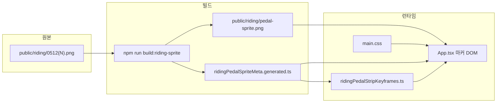

# 260512-주행 마커(라이더) 애니메이션 작업 과정 및 로직 보고서

**작성일:** 2026-05-12  
**대상:** OSRM 주행 시뮬레이션에 표시되는 Mapbox 커스텀 마커(라이더)의 페달링 애니메이션  
**관련 경로:** `public/riding/`, `scripts/build-riding-pedal-sprite.mjs`, `ridingPedalSpriteMeta.generated.ts`, `ridingPedalStripKeyframes.ts`, `App.tsx`, `main.css`

---

## 1. 목적

- 주행 중 지도 위 라이더가 **정지 이미지가 아니라 페달링하는 느낌**으로 보이게 한다.
- **속도(또는 BLE 케이던스)** 에 맞춰 루프 주기를 바꿔 역동적으로 보이게 한다.
- **투명 배경**이 지도에 올바르게 합성되도록 한다(흰 사각형, 캐시 이슈 방지).

---

## 2. 전체 데이터 흐름



1. 디자이너(사용자)가 `public/riding/`에 프레임 PNG를 둔다.  
2. `npm run build:riding-sprite`로 **가로 스프라이트**와 **프레임 수 메타**를 생성한다.  
3. 앱은 메타의 `RIDING_PEDAL_FRAME_COUNT`, `RIDING_PEDAL_CELL_PX`와 스프라이트 URL을 사용해 **CSS 스텝 애니메이션**으로 재생한다.

---

## 3. 원본 프레임 규칙 (`public/riding/`)

| 항목 | 내용 |
|------|------|
| 파일명 패턴 | `0512(10).png` 또는 `0512 (100).png` — 정규식 `^0512\s*\((\d+)\)\.png$` |
| 정렬 | 괄호 안 **숫자 오름차순** (연속일 필요 없음) |
| 제외 | 출력물 `pedal-sprite.png`는 목록에서 제외 |
| 포맷 | **RGBA PNG** 권장. 알파만 있고 RGB가 흰색으로 남은 경우는 빌드 단계에서 보정(§5 참고) |

---

## 4. 빌드 스크립트 (`scripts/build-riding-pedal-sprite.mjs`)

### 4.1 처리 순서(프레임당)

1. **sharp**로 PNG를 읽고 `ensureAlpha()` 후 **raw RGBA** 버퍼로 추출한다.  
2. **가장자리와 연결된 “거의 흰색” 배경 제거**(§5).  
3. 셀 크기 **`CELL = 120`** (`App.tsx`의 `SIMULATION_MARKER_SIZE_PX`와 동일)으로 `resize`, `fit: 'contain'`, 배경은 **완전 투명**.  
4. PNG 버퍼로 모아 스프라이트 한 줄에 **좌→우**로 `composite`한다.

### 4.2 스프라이트 캔버스

- 폭: `CELL × 프레임 수`  
- 높이: `CELL`  
- 생성 시 배경: RGBA `(0,0,0,0)`  

### 4.3 생성물

| 출력 | 설명 |
|------|------|
| `public/riding/pedal-sprite.png` | 가로 스프라이트 이미지 |
| `ridingPedalSpriteMeta.generated.ts` | `RIDING_PEDAL_FRAME_COUNT`, `RIDING_PEDAL_CELL_PX` — **수동 수정 금지** |

---

## 5. 투명 배경(흰 박스) 처리 로직

### 5.1 문제 상황

- 파일에 알파 채널이 있어도, **모서리가 RGB(255,255,255)에 불투명 알파**인 경우 지도 위에 흰 사각형처럼 보일 수 있다.

### 5.2 알고리즘: 테두리 기준 BFS

- 임계값: 환경변수 `RIDING_EDGE_WHITE_THRESHOLD` (기본 **249**).  
- 한 픽셀이 “배경 후보”인 조건: `R ≥ thr && G ≥ thr && B ≥ thr`.  
- **이미지 네 변**에서 위 조건을 만족하는 픽셀을 큐에 넣고, 4방향으로만 전파(BFS).  
- 방문한 픽셀은 **RGBA 전부 0**으로 만든다.

**의도:** 가장자리와 **이어진** 흰/밝은 배경만 제거하고, 캐릭터 **내부**의 밝은 디테일은 가장자리와 연결되지 않으면 유지한다.

### 5.3 한계

- 배경이 **밝은 회색**이거나 흰색과 이어진 **얇은 밝은 다리**로 캐릭터와 연결되면 일부가 지워질 수 있다. 임계값 조정 또는 소스 수정이 필요할 수 있다.

---

## 6. 런타임: Mapbox 마커 DOM 구조 (`App.tsx`)

Mapbox GL JS는 전달한 `element`에 직접 `mapboxgl-marker` 등 클래스를 붙인다. 구조는 다음과 같다.

```
div.cycling-sim-marker-host.mapboxgl-marker   ← 루트(120×120), 투명 배경
  └── div.cycling-sim-marker-flip            ← 진행 방향에 따라 scaleX(-1)
        └── div.cycling-sim-marker-stack
              └── div.cycling-sim-marker-pedal-sprite
                    background-image: /riding/pedal-sprite.png?v=…
```

- **`flip`**: `computeHeading` 결과로 경로 진행 방향이 뒤집힐 때 `scaleX(-1)` 적용.  
- **스프라이트 URL**: `CYCLING_POSITION_MARKER_PEDAL_SPRITE_URL`  
  - 캐시 무력화: `RIDING_PEDAL_SPRITE_REVISION` 쿼리 파라미터(이미지 교체 시 증가).

---

## 7. 애니메이션(CSS) 로직

### 7.1 왜 `main.css`에 `steps(N)` 고정이 없는가

프레임 수 `N`은 빌드마다 바뀔 수 있어, **`ridingPedalStripKeyframes.ts`** 가 한 번만 `<style>`을 주입한다.

- `@keyframes cycling-marker-riding-pedal-cycle`  
  - `from`: `background-position: 0 0`  
  - `to`: `background-position: -(N × CELL) px 0`  
- `.cycling-sim-marker-pedal-sprite`  
  - `animation-name`, `animation-timing-function: steps(N, end)`, `animation-iteration-count: infinite`

`main.css`에는 레이아웃·배경 반복·드래그 방지 등만 두고, **스텝 수·키프레임 끝 좌표는 주입 스타일**이 담당한다.

### 7.2 `background-size`

- 가로: `RIDING_PEDAL_CELL_PX * RIDING_PEDAL_FRAME_COUNT`  
- 세로: `RIDING_PEDAL_CELL_PX`  

한 뷰포트(마커 120×120)에 **한 셀만** 보이게 하고, `background-position` 애니메이션으로 옆 셀을 순서대로 보여준다.

---

## 8. 속도·케이던스와 루프 주기 (`App.tsx` 시뮬 동기 effect)

### 8.1 표시용 RPM `pedalRpm`

**센서 케이던스 사용 조건** (`useSensorCadence`):

- `sensorPrefs.sensorDriveEnabled`  
- `sensorHubConnected`  
- `emaRpm` 유효(숫자, NaN 아님)  
- `emaRpm >= SENSOR_PEDALING_RPM_THRESHOLD` (코드상 **8 RPM**)

만족 시:

- `pedalRpm = clamp(emaRpm, CRANK_RPM_MIN, CRANK_RPM_MAX)`  
  - `CRANK_RPM_MIN = 14`, `CRANK_RPM_MAX = 128`

그렇지 않으면 **속도 기반 추정**:

- `estimateCrankRpmFromSpeedKmh(speedNow)`  
  - `speedNow`는 `effectiveSpeedKmHRef.current`  
  - 공식: `min(128, max(16, 22 + speed × 2.85))` (km/h 상한 95로 클램프)

### 8.2 한 루프 시간(초)

- `pedalLoopSec = 60 / pedalRpm`  
- 안전 클램프: **0.22 ~ 5.5** 초

### 8.3 재생/정지

- `sprite.style.animationDuration = pedalLoopSec + 's'`  
- `pedalingRunning = simulation.isActive && speedNow > 0.35` 일 때 `animationPlayState = 'running'`, 아니면 `'paused'`

즉, **시뮬이 돌고 있고 속도가 어느 정도 있을 때만** 페달 애니가 돈다.

---

## 9. 스타일 보조 (`main.css`)

- `.cycling-sim-marker-host` 및 `.mapboxgl-marker` 조합에 **`background: transparent !important`** 를 주어, 마커 루트에서 흰 박스가 비치지 않도록 한다.

---

## 10. 운영 체크리스트

| 단계 | 작업 |
|------|------|
| 1 | `public/riding/`에 프레임 PNG 추가·교체 |
| 2 | `npm run build:riding-sprite` 실행 → `pedal-sprite.png` + `ridingPedalSpriteMeta.generated.ts` 갱신 |
| 3 | 브라우저·WebView 캐시 이슈 시 `App.tsx`의 **`RIDING_PEDAL_SPRITE_REVISION` 증가** |
| 4 | `npm run build` 후 Capacitor 사용 시 **`npx cap sync`** |
| 5 | 배경이 흰색이 아닌 경우 | `RIDING_EDGE_WHITE_THRESHOLD` 조정 또는 소스 PNG 알파 수정 |

---

## 11. 관련 npm 스크립트

- `build:riding-sprite` → `node scripts/build-riding-pedal-sprite.mjs`  
- (참고) `build:cycling-marker-webp` 는 **별도** `cycling_position_marker_*` 용 빌드로, 현재 라이더 스프라이트와는 역할이 다르다.

---

## 12. 요약

- **소스:** 사용자 제작 프레임 `public/riding/0512*.png`  
- **빌드:** sharp로 스프라이트 + 메타 생성, **테두리 BFS**로 흰 배경 제거 후 120×120 셀로 정규화  
- **런타임:** Mapbox 마커 DOM + 주입 CSS `steps(N)` 필름스트립, **RPM(센서 또는 속도 추정)** 으로 `animation-duration` 제어  
- **품질:** 투명 루트·쿼리 버전·메타 자동 동기로 유지보수 부담을 줄인 구조이다.

---

*본 문서는 저장소 내 코드 상태(2026-05-12 기준)를 바탕으로 정리하였다.*
