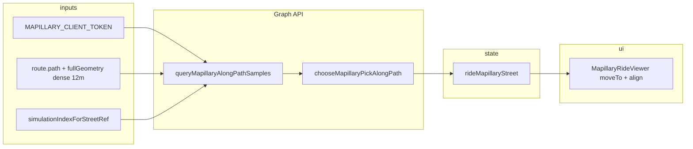

# Mapillary 기준 거리뷰 디스플레이 로직 보고서

**작성일:** 2026-05-14  
**범위:** 앱에서 “주행 중 거리뷰”로 쓰이는 **Mapillary** 파이프라인만 기술한다. **Google Street View 등 다른 거리뷰 엔진은 본 문서에 포함하지 않는다.**  
**핵심 파일:** `App.tsx`, `MapillaryRideViewer.tsx`, `services/mapillaryStreetView.ts`, `services/mapillaryCoverage.ts`, `mapillaryToken.ts`  
**관련(경로 스냅만):** `services/mapillaryRouteSnap.ts` — 거리뷰 패널 직접 제어는 아니나 OSRM 정점을 Mapillary 근처로 당기는 정책과 겹친다.

---

## 1. 구성 요소 두 갈래

사용자가 “Mapillary”와 연관해 보는 화면 요소는 성격이 다르다.

| 구분 | 역할 | 표시 조건 |
|------|------|-----------|
| **A. 맵 오버레이(커버리지)** | Mapbox 맵 위에 Mapillary **촬영 시퀀스 라인**(일반·360 구분 색) 벡터 타일 | `VITE_MAPILLARY_CLIENT_TOKEN` 설정 + 사용자가 **Mapillary 커버리지 토글** ON |
| **B. 주행 플로팅 패널(거리뷰)** | `mapillary-js` **Viewer**로 현재 선택된 **이미지 키**를 전면에 재생 | 토큰 + 주행 활성 + Graph API로 **유효 이미지**가 잡혔을 때 `rideMapillaryStreet` state 존재 |

본 보고서의 “거리뷰 디스플레이”는 주로 **B**를 말하되, **A**는 같은 토큰·브랜딩 맥락에서 맵에 “어디에 촬영이 있는지”를 보여 주는 부분이므로 한 절에서 정리한다.

---

## 2. 전제 조건·토큰

- **`mapillaryToken.ts`:** `import.meta.env.VITE_MAPILLARY_CLIENT_TOKEN` → `MAPILLARY_CLIENT_TOKEN`.
- **`mapillaryTokenConfigured`:** 토큰 문자열 길이 &gt; 0일 때만 거리뷰 effect·커버리지 부착이 의미 있다.
- 토큰이 없으면: `resetRideMapillaryStreetState()`로 거리뷰 state 정리, 커버리지 토글 강제 off 등(`App.tsx`).

---

## 3. (A) 맵 위 Mapillary 커버리지 레이어

**파일:** `services/mapillaryCoverage.ts`

- **소스:** `https://tiles.mapillary.com/maps/vtp/mly1_public/2/{z}/{x}/{y}?access_token=...` (MVT, `source-layer: sequence`).
- **레이어:**
  - `MAPILLARY_SEQUENCE_LAYER_ID`: 일반 시퀀스, 주황(`#f97316`).
  - `MAPILLARY_PANO_SEQUENCE_LAYER_ID`: `is_pano` 필터, 파랑(`#2563eb`).
- **초기 visibility:** `none` — `setMapillaryCoverageLayersVisibility`로 사용자 토글 반영.
- **스택 순서:** `stackMapillaryAboveRoutableBelowRoute` — OSRM 라우터블(시안) 위, **주 경로선(`ROUTE_LAYER`) 바로 아래**에 두어 가독성 유지.

거리뷰 **패널(B)** 을 켜는 것과 **직접 연동되지는 않는다**(커버리지는 참고용 오버레이).

---

## 4. (B) 주행 거리뷰 — 데이터·좌표계

### 4.1 렌더용 path vs Mapillary 질의용 “촘촘한” path

- **렌더/시뮬 `route.path`:** 대략 **18m** 간격으로 densify된 주행용 꼭짓점(다른 상수와 함께 쓰이는 정책과 일치).
- **Mapillary Graph 질의:** `MAPILLARY_QUERY_PATH_INTERVAL_M = 12` — **`lastOsrmDecodedPathRef`(OSRM fullGeometry)** 가 있으면 그것을 12m로 densify, 없으면 sparse path를 소스로 동일 처리.

**`mapillaryStreetDensePathChunks` (`useMemo`):**

- `densePath`, `cumDense`(12m 경로 누적거리), `cumSparse`(렌더 path 누적거리)를 함께 들고 있다.
- 주행 인덱스 `idx`는 **sparse path 기준**이지만, Graph 샘플링의 `queryIdx`는 **sparse 상의 누적거리 → dense 상 동일 거리 이하 인덱스**로 변환해, “옆 도로 nearest” 오인을 줄인다.

### 4.2 시야 동기 객체 `mapillaryRideSync` (`useMemo`)

`simulation.currentIndex`와 `mapillaryStreetDensePathChunks`에 의존.

- **전방 점 `lookAt`:** `pathPointAhead(..., 52)` — 현재 인덱스에서 경로를 따라 **약 52m 앞** 좌표. chunks가 있으면 **dense path + denseIdx** 기준으로 다시 계산해 더 촘촉한 선상의 전방을 쓴다.
- **`driveHeadingDeg`:** `driveHeadingAtPathIndex` — 현재 인덱스와 **+14 꼭짓점**을 잇는 방위(도). dense가 있으면 dense 기준으로 재계산.

이 값들은 **`MapillaryRideViewer`**에 그대로 넘겨, `project` / `setCenter`로 **시야를 주행 방향·전방에 맞춘다.**

---

## 5. (B) 이미지 후보 수집 — Graph API

**파일:** `services/mapillaryStreetView.ts`

### 5.1 `fetchMapillaryStreetCandidates`

- **URL:** `https://graph.mapillary.com/images`
- **쿼리:** `access_token`, `lat`, `lng`, `radius`, `limit=12`, `fields`(id, geometry, compass, sequence, `is_pano` 등).
- **반경:** `mapillaryStreetSearchRadiusM(speedKmH)` — 속도에 따라 16~28m 가량 후 **10~50m**로 클램프(Graph 규약과 “옆 도로” 트레이드오프).
- **후보 타입 `MapillaryStreetCandidate`:** `id`, `lat`/`lng`, `compassAngle`, `sequenceId`, `isPano` 등.

### 5.2 `pickMapillaryStreetCandidate`

- 후보가 1개면 그대로 반환.
- **주행 방위 `driveHeadingDeg`가 없으면** 순수 거리 최소 후보.
- 있으면: 나침반 있는 후보 중 **진행 방위와 45° 이내**(`MAX_HEADING_DIFF_DEG`)인 것을 우선 풀로 쓰고, 점수식으로 **거리 + 전방 정렬 + 나침반 정렬**을 합산해 최적 1장 선택.

### 5.3 `queryMapillaryAlongPathSamples`

- 입력: `path`, `startIdx`, **전방 거리 샘플 배열** `MAPILLARY_STREET_LOOKAHEAD_SAMPLES_DENSE_M` (0m부터 300m까지 촘촘한 거리 표본).
- 각 `sampleM`에 대해 `pathPointAhead` → 해당 지점에서 `fetch` → `pick`을 **병렬(`Promise.all`)**로 수행.
- 반환: `{ sampleM, pick | null }[]` — 이후 “경로를 따라 가장 이른 히트” 선택에 사용된다.

### 5.4 `chooseMapillaryPickAlongPath`

- 히트가 있는 행만 모은 뒤, **가장 가까운 `sampleM`(min)** 을 기준으로 **`minSampleHit + 48m` 봉투** 안의 후보만 우선(먼 전방만 히트할 때 수백 m 점프 방지).
- 사용자가 닫은 이미지 `dismissedId`는 가능하면 제외.
- **이전 프레임 `prevPick`:** 라이더가 그 촬영점에서 **70m 이상** 멀어지면 연속성 가중을 끈다(`stalePrevRiderDistM`).
- 점수: `sampleM` 가중 + 이전 촬영점과의 거리 페널티(`maxGpsJumpM` 등) − 같은 id/같은 sequence 가산점.

---

## 6. (B) `App.tsx` — 주기적 fetch·상태 머신

### 6.1 `simulationIndexForStreetRef`

- 렌더마다 `simulationIndexForStreetRef.current = simulation.currentIndex`로 동기화.
- **이유:** 거리뷰 전용 `useEffect`의 dependency에 `currentIndex`를 넣으면 **매 틱마다 cleanup → `AbortController.abort`**로 fetch가 끊긴다. 그래서 **ref + 짧은 interval**로만 최신 인덱스를 읽는다(코멘트 명시).

### 6.2 effect 가드

- `!mapillaryTokenConfigured || !route?.path?.length` → `resetRideMapillaryStreetState()`.
- `!simulation.isActive` → **early return만**(state를 여기서 비우지 않음: 일시정지 시 패널 유지 등 UX).

### 6.3 `tryFetch` 스로틀

| 상수 | 값 | 의미 |
|------|-----|------|
| `MAPILLARY_STREET_FETCH_MIN_MOVE_M` | 24 | 앵커 대비 라이더가 이만큼(m) 이상 움직여야 새 조회 |
| `MAPILLARY_STREET_FETCH_THROTTLE_MS` | 780 | 또는 이 시간이 지나면 이동이 작아도 조회 가능 |
| 폴링 interval | `clamp(120, throttle/2, 400)` | 약 120~400ms마다 `tryFetch` 시도 |

조회 시 `lastMapillaryStreetAnchorRef`·시각 갱신, **`mapillaryStreetFetchGenRef`**로 세대 번호를 올려 **이전 비동기 결과 폐기**.

### 6.4 조회 파이프라인

1. `queryPath = chunks?.densePath ?? path`
2. `queryIdx` = chunks 있으면 sparse idx → 누적거리 → dense index, 없으면 `idx`
3. `queryMapillaryAlongPathSamples(TOKEN, queryPath, queryIdx, SAMPLES, { signal, speedKmH })`
4. `gen` 불일치 시 return
5. `chooseMapillaryPickAlongPath(rows, { dismissedId, prevPick, maxGpsJumpM: 58, riderLatLng, stalePrevRiderDistM: 70 })`

### 6.5 `rideMapillaryStreet` state

- 형태: `{ imageKey: string; shownAtMs: number; isPano: boolean }`.
- **히트 없음:** 기존 패널이 있으면 `shownAtMs` 기준 **`MAPILLARY_STREET_NO_HIT_GRACE_MS`(9000ms)** 이후에만 `null`로 닫힘(순간 공백으로 깜빡이지 않게).
- **히트 있음:**  
  - **`MAPILLARY_STREET_MIN_HOLD_MS`(1350ms)** 미만이면 **같은 키가 아닌 새 프레임으로의 전환을 막음**(짧은 구간에서 이미지가 도리도리 바뀌는 것 완화).  
  - `holdBlocksNewFrame`이면 `lastMapillaryStreetPickRef`는 갱신하지 않는다(연속성 점수가 꼬이지 않게).

### 6.6 큰 점프·닫기 UX

- 앵커가 **130m 이상** 이동하면 `dismissedKey`·`prevPick`을 리셋(경로 점프·세션 경계에 가깝게 처리).
- 닫기 버튼: `lastMapillaryStreetDismissedKeyRef = imageKey` 후 `setRideMapillaryStreet(null)` — 같은 키가 바로 다시 뜨는 것을 **한동안** 억제하는 데 `dismissedId`로 연결된다.

### 6.7 생명주기

- effect cleanup: `clearInterval` + `AbortController.abort()` — 주행 종료·경로 변경 시 진행 중인 Graph 요청 취소.
- `resetRideMapillaryStreetState`: 앵커·시각·세대·pick·state 초기화 — 토큰 없음, 정지 처리 등에서 호출.

---

## 7. (B) 플로팅 패널 UI 레이아웃

**조건:** `rideMapillaryStreet && route?.path?.length`

- **`fixed`**, `z-[1005]`, 최대 높이 `min(50dvh, 300px)` / 가로모드는 더 큰 상한.
- **`left`:** `SAFE_LEFT_1REM`
- **`bottom`:** 안전영역 + **`max(routePanelHeightPx, elevationPanelHeightPx)`** — 왼쪽 경로/표고 패널 높이에 맞춰 **가려지지 않게** 띄운다.
- **`width`:** `min(100vw - safe insets - 2rem, 240px)` — 모바일 한 손 폭 고려.
- 헤더: “Mapillary” 라벨 + 닫기(`X`).
- 본문: `aspect-video` 컨테이너 안에 **`MapillaryRideViewer`**.
- 푸터: `Imagery © Mapillary contributors`.

---

## 8. `MapillaryRideViewer.tsx` — mapillary-js 표시·시야 정렬

### 8.1 Viewer 생성 (`accessToken` 변경 시 1회)

- `new Viewer({ accessToken, container, transitionMode: Instantaneous, component: { cover: false, direction: false, sequence: { visible: false } } })`
- **전환 모드:** 항상 **Instantaneous** — 주행 중 “날아오는” 블렌드 없이 **스틸컷**처럼 컷 전환.
- 언마운트 시 `viewer.remove()`.

### 8.2 `imageId` / `sphericalNavigation` effect

1. **필터:** `sphericalNavigation === true`이면 `viewer.setFilter(['==', 'cameraType', 'spherical'])`, 아니면 필터 해제. 변경 시에만 적용.
2. **같은 imageId + 필터 무변**이면 `moveTo` 생략(시야 보정은 아래 lookAt effect로만).
3. 그 외: `viewer.moveTo(imageId)` 후 **`alignViewToRide(..., 'full')`** — 전방 `project` → `unprojectToBasic` → `setCenter` 우선, 실패 시 360에서만 방위 기반 UV 보정.
4. `CancelMapillaryError`는 무시(사용자 전환·취소).
5. **`viewReady`:** 첫 세션 첫 이미지 로드 전에만 opacity 0으로 깜빡임 완화; 전환 자체는 transition 없음.

### 8.3 방위 스무딩

- `HEADING_SMOOTH_ALPHA = 0.14` — `driveHeadingDeg`를 저역 통과해 **`bearingTargetDeg`**로 사용(뷰어 내부 스냅샷 비교·정렬에 사용).

### 8.4 `lookAt` / 방위 변경 시 재정렬 (debounce)

- **조건:** 현재 `imageId`가 로드된 것과 같을 때만.
- **임계:** 직전 스냅샷 대비 전방점 이동 **18m 미만**且 방위 차 **14° 미만**且 **5200ms** 이내면 스킵.
- **디바운스:** **820ms** 후 `alignViewToRide(..., 'bearingDrift')` — 같은 파노 안에서 잦은 `setCenter` 충돌을 줄임.
- `softenBasicYTowardHorizon`: equirectangular **Y가 극단**이면 지평선 쪽으로 당겨 하늘/발바닥만 보이는 것을 완화(완전한 도로 정면은 한계가 있다는 주석).

---

## 9. end-to-end 흐름 요약

---

## 10. 운영·디버깅 포인트

- **429/네트워크:** fetch 실패 시 catch로 세대 검사만 하고 조용히 종료 — 사용자는 grace 동안 **마지막 프레임**을 볼 수 있다.
- **커버리지 없는 지역:** 히트가 없으면 9초 후 패널이 사라질 수 있음 — 정상 동작.
- **360(`isPano`):** Viewer에서 spherical 필터 + `sphericalNavigation` prop으로 **공간 탐색을 360에 한정**.
- **Google Street View:** 본 앱의 이 거리뷰 패널 경로에는 연결되어 있지 않으며 본 문서 범위에서 제외한다.

---

## 11. 코드 위치 빠른 참조

| 주제 | 파일·대략 위치 |
|------|----------------|
| 상수·state·reset | `App.tsx` ~163–197, ~918–970, ~3103–3215 |
| `mapillaryRideSync` | `App.tsx` ~970–991 |
| 플로팅 패널 JSX | `App.tsx` ~5211–5250 |
| Graph API·선택 알고리즘 | `services/mapillaryStreetView.ts` |
| 맵 커버리지 타일 | `services/mapillaryCoverage.ts` |
| Viewer·정렬 | `MapillaryRideViewer.tsx` |
| 토큰 | `mapillaryToken.ts` |

---

*본 문서는 작성 시점 소스 기준이며, 상수·URL 정책 변경 시 동기화를 권장한다.*
