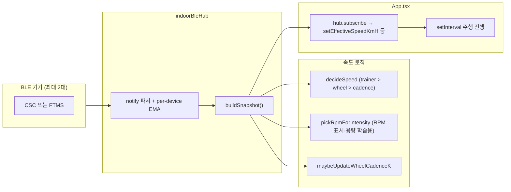

# 실내 사이클 앱 — 센서(BLE) 연동 구현 분석 보고서

작성일: 2026-05-14  
대상 코드베이스: `cycle` (Capacitor + React + TypeScript)

---

## 1. 목적과 범위

이 문서는 **Bluetooth Low Energy(BLE)** 로 실내 트레이너·케이던스·휠 센서 등을 연결하고, 그 신호를 **시뮬레이션 주행 속도·페달 애니메이션·용량(capacity) 학습**에 반영하기 위해 코드로 구현한 내용을 정리한다.

**포함**

- Capacitor BLE 플러그인 기반 허브(`indoorBleHub`)
- GATT 서비스/특성 파싱(CSC, FTMS)
- 속도 결정 파이프라인(`effortModel.decideSpeed`)
- 케이던스/휠 블렌딩(`dualMerge`)
- 로컬 저장 설정(`sensorPrefs`)
- `App.tsx`·`SensorsModal.tsx`·`BikeProfileModal.tsx`와의 연결

**제외(참고만)**

- Android `AndroidManifest` 권한 XML 세부(플러그인 문서 참고)
- 광고(AdMob)·지도(Mapbox) 본체

---

## 2. 기술 스택과 의존성

| 구분 | 내용 |
|------|------|
| BLE 플러그인 | `@capacitor-community/bluetooth-le` (^8.1.3) |
| 런타임 API | `BleClient.initialize`, `requestLEScan`, `connect`, `discoverServices`, `startNotifications` / `stopNotifications`, `disconnect` |
| 플랫폼 | Capacitor 네이티브(주로 Android 앱 빌드 가정). Web Bluetooth와의 차이는 `discoverServices` 실패 시 무시 등으로 흡수 |

초기화 시 `BleClient.initialize({ androidNeverForLocation: true })`를 사용해, Android 12+에서 위치 권한과 결합되지 않도록 한다(`indoorBleHub.ts`).

---

## 3. 전체 아키텍처

데이터는 **BLE 노티피케이션 → 디바이스별 스무딩 → 스냅샷 집계 → 속도 결정 → UI/시뮬레이션** 순으로 흐른다.

---

## 4. BLE GATT — 지원 서비스와 파싱

구현 파일: `sensor/indoorBleHub.ts`

### 4.1 스캔 필터

`requestLEScan`에 서비스 UUID 배열을 넘겨 **CSC(0x1816)** 또는 **FTMS(0x1826)** 를 광고하는 주변 기기만 수집한다.

- CSC 측정 특성: `0x2A5B` (Cycling Speed and Cadence Measurement)
- FTMS 실내 자전거 데이터: `0x2AD2` (Indoor Bike Data)

### 4.2 FTMS Indoor Bike Data (`parseIndoorBikeData`)

Bluetooth FTMS 스펙에 맞춰 **flags(uint16 LE)** 로 필드 유무를 판별한다.

- **bit 0 (More Data)**: SET이면 순간 속도 필드가 **없음**; 클리어면 **순간 속도(uint16, 0.01 km/h)** 존재
- **bit 4**: 순간 케이던스(uint16, 0.5 rpm 단위)
- **bit 6**: 순간 파워(sint16, W)

잘못된 오프셋으로 파싱하던 이전 버그를 방지하기 위해, 주석에 명시된 대로 **flags에 따라 오프셋 `o`를 순차 증가**시키며 읽는다. 순간 속도는 0~80 km/h로 클램프해 펌웨어 오류를 완화한다.

### 4.3 CSC Measurement (`parseCscMeasurement`)

- flags bit0: 휠 누적 회전(uint32) + 마지막 휠 이벤트 시각(uint16, 1/1024 s)
- flags bit1: 크랭크 누적 회전(uint16) + 마지막 크랭크 이벤트 시각(uint16, 1/1024 s)

이전 샘플과의 차분으로 **휠 RPM**, **케이던스 RPM**을 계산한다. 카운터 래핑은 모듈로 연산 처리한다.

### 4.4 연결당 프로토콜 선택

`connect()` 시 **FTMS Indoor Bike Data 노티를 먼저 시도**하고, 성공하면 CSC는 쓰지 않는다. FTMS가 없을 때만 CSC 노티를 구독한다. 한 기기에서 두 스트림을 중복 구독하지 않도록 분기한다.

### 4.5 디바이스별 EMA 스무딩

상수 `EMA_A = 0.38` 인 지수 이동 평균으로 cadence/wheel/power/trainerSpeed를 부드럽게 한다.

### 4.6 최대 2대 연결과 순서

- 동시 연결 상한: **2대**. 초과 시 에러.
- `order: string[]` — **연결 순서**가 스냅샷에서 “첫 번째로 값이 잡히는 채널” 우선순위에 사용된다.

### 4.7 `buildSnapshot()`

연결된 각 디바이스의 스무딩 값을 순회하며:

1. **케이던스**: 첫 번째로 `cadenceRpm > 0` 인 디바이스 채택  
2. **휠 RPM**: 첫 번째로 `wheelRpm > 0`  
3. **파워**: 첫 번째로 `powerW > 0`  
4. **트레이너 속도**: 첫 번째로 `trainerSpeedKmh >= 0`

이후 **스테일 타임아웃**(케이던스/휠 3s, 파워 3s, 트레이너 속도 3s)으로 오래된 값은 `null` 처리한다.

반환 타입 `BleSnapshot`은 `sensor/dualMerge.ts`에 정의되어 `effortModel`과 공유된다.

### 4.8 UI 갱신 스로틀

`NOTIFY_THROTTLE_MS = 125` 로 리스너 `emit` 빈도를 제한해 React 쪽 구독 폭주를 완화한다.

### 4.9 자동 재연결

- 수동 `connect` 시 `reconnectWanted`에 기기를 등록하고, 끊기면 **백오프**(0, 4s, 8s, …, 60s)로 `tryAutoReconnect` 루프를 돈다.
- `tryAutoReconnect(savedDevices, { allowUnknown, scanDurationMs })`: 저장된 기기를 우선 스캔에서 찾아 연결하고, `allowUnknown`이면 RSSI 순으로 빈 슬롯을 채운다.
- 사용자가 `disconnect(deviceId)` 하면 해당 기기는 재연결 대상에서 제외된다.

---

## 5. 설정·영속화 — `sensor/sensorPrefs.ts`

### 5.1 `IndoorSensorPrefs` 주요 필드

| 필드 | 의미 |
|------|------|
| `sensorDriveEnabled` | 센서 기반 주행 모드 여부 |
| `preferredRideMode` | `'manual' \| 'sensor'` — 기본 선호(저장·복원) |
| `fitnessLevel` | 체력 단계 → 기본 기준 속도·용량 프리셋 |
| `calibrationAvgRpm` / `calibrationAt` | 1분 테스트 평균 RPM 및 시각 |
| `capacityRpm` | 개인 케이던스 “용량”(낮은 RPM 대비 속도 곡선에 사용) |
| `speedCadenceBlendMode` | `'auto' \| 'speed' \| 'cadence'` — 강도용 RPM 선택 정책 |
| `wheelCadenceK` | 휠 RPM ÷ 케이던스 비율의 학습값(이상치 필터에 사용) |
| `lastConnectedDevices` | 최대 2개까지 최근 연결 기기(ID, 이름) |
| `autoReconnectEnabled` | 자동 재연결 on/off |
| `bikeProfile` / `wheelCircumferenceMm` | 바이크 종류 및 둘레(mm) — `vFromWheel`에 사용 |
| `feelK` | 체감 속도 배율(0.70~1.30) |

저장 키: `localStorage` `indoor_sensor_prefs_v1`. 로드 시 타입·범위 검증 및 구 스키마(`loadHint`, `frail` 등) 마이그레이션 처리가 있다.

### 5.2 `feelK` / 바이크 둘레

- `clampFeelK`로 0.70~1.30, 0.01 단위 반올림.
- `BIKE_PROFILE_CIRCUMFERENCE_MM`에 프리셋별 기본 둘레가 정의되어 있다.

---

## 6. 속도 결정 — `sensor/effortModel.ts`

### 6.1 설계 원칙 (주석과 일치)

**센서 입력 → 속도 후보 → 이상치 필터 + EMA → 소스 선택**

- **1순위**: FTMS **트레이너 순간 속도** (`trainerSpeedKmh`)
- **2순위**: **휠 RPM × 둘레** 기하학적 속도 (`vFromWheel`)
- **3순위**: **케이던스만** 유효할 때, 피트니스·용량 기반 “노력 속도” (`vFromCadence` = `computeIndoorSensorRideSpeedKmh`)

`prefs.sensorDriveEnabled === false` 이면 항상 **수동 슬라이더 속도**(`manualKmh`)를 반환한다.

### 6.2 케이던스 기반 속도 `computeIndoorSensorRideSpeedKmh`

- `baseSpeedFromFitnessLevel`: 체력 단계별 기준 km/h (예: medium 17).
- `intensity = smoothedRpm / capacityRpm`, `fIntensity`로 비선형 스케일.
- 저 RPM 구간(15 미만, 30 미만)은 별도 감쇠로 “너무 빨리 나가지 않게” 조정.
- 상한 70 km/h.

### 6.3 `applySpeedFilter` (이상치·코스팅·EMA)

- **휠 소스 + 학습된 `wheelCadenceK`**: 순간 비율 `wheelRpm/cadenceRpm`이 학습값 대비 50% 이상 벗어나면 **연속 3프레임**까지는 이전 EMA를 유지(스파이크 억제). 그 이상 지속되면 기어 변화 등으로 보고 수용.
- **코스팅**: 휠/트레이너 소스인데 케이던스가 거의 없으면 raw 속도에 **0.6** 배 가산(플라이휠 관성).
- **EMA**: 트레이너는 알파 0.5, 그 외 `SPEED_EMA_ALPHA = 0.25`.
- **휠 웨이크업**: 휠 채널이 5초 이상 침묵 후 다시 오면 **첫 샘플은 무시**(CSC 1024Hz 타이머 래핑 아티팩트 완화).

### 6.4 트레이너 경사 계수 `trainerGradeFactor`

경사(%)에 따라 ±30% 범위에서 속도 배율을 조정한다. **`decideSpeed`의 트레이너 분기에서만** 곱해지며, 케이던스/휠만 쓰는 경로에는 적용하지 않아 이중 보정을 피한다.

### 6.5 현재 `App.tsx` 연동 한계

`App.tsx`에서 `decideSpeed` 호출 시 **6번째 인자 `gradePercent`를 넘기지 않아 기본값 0**이다. 즉, **지도 경사를 트레이너 속도에 반영하는 훅은 모델에 있으나 UI/시뮬레이션 레이어에서는 아직 미사용**이다.

---

## 7. 듀얼 채널 블렌딩 — `sensor/dualMerge.ts`

### 7.1 `BleSnapshot`

`now`, 케이던스/휠/파워/트레이너 속도와 각각의 타임스탬프를 담는다. `power`는 스냅샷에 있으나 **RPM 합성에는 사용하지 않는다**(주석).

### 7.2 `pickRpmForIntensity`

강도·용량 학습·HUD용으로 **하나의 RPM**을 고른다.

- **선택 규칙(현재 구현)**: `speedCadenceBlendMode`가 `'cadence'`이든 `'auto'` / `'speed'`이든, 분기 안의 로직은 동일하다. 즉 **케이던스 채널이 유효하면 `cadScaled`**, 아니면 **휠 채널이 유효하면 `wheelRpm`** 을 쓴다. UI에 “Speed / Auto / Cadence” 옵션이 있으나, **휠을 우선하는 별도 `speed` 전용 경로는 현재 코드에 없음**(향후 확장 여지).
- 휠 급강하 + 케이던스 안정 패턴이면 휠 RPM을 **이전 값과 블렌드**해 급락 완화.
- 케이던스 급상승 시 소폭 `cadBoost`(1.08).

### 7.3 `maybeUpdateWheelCadenceK`

휠·케이던스 채널이 모두 유효하고 RPM이 충분히 클 때, `wheelRpm / cadenceRpm`의 순간값을 **이전 K에 0.97/0.03 EMA**로 누적해 `wheelCadenceK`를 갱신한다. 변경이 임계 이상일 때만 `onNewK` 콜백으로 저장을 트리거한다.

---

## 8. UI 계층

### 8.1 `SensorsModal.tsx`

- 모달 오픈 시 `hub.initialize()`로 BLE 준비; 실패 시 `initError`.
- **스캔**: `startScan` 후 8초 뒤 자동 `stopScan`.
- **연결**: `connect` → `upsertSavedDevice`로 `lastConnectedDevices` 갱신 → `autoReconnectEnabled`이면 `requestPersistentConnection(..., { allowUnknown: true })`.
- **에러 메시지**: Zwift 등 점유·timeout 계열 메시지를 사용자 친화 문구로 매핑.
- **1분 캘리브레이션**: 1초 간격으로 `getPrimaryCadenceRpm()` 샘플링(>10 RPM만), 종료 시 평균으로 `calibrationAvgRpm`·`capacityRpm = initialCapacityFromTestRpm` 설정.
- **고급**: 바이크 프로필 select, 자동 재연결 체크, speed/cadence 블렌드 select, 기본 라이드 모드 저장.

### 8.2 `BikeProfileModal.tsx`

휠 속도 센서가 처음 의미 있게 잡힐 때(`App`에서 휠 안정 3초 + `bikeProfile === 'unset'`) **1회** 바이크 종류를 묻는 모달. 선택 시 `onSave`로 프로필·둘레를 반영한다.

### 8.3 `App.tsx` — HUD·퀵 토글·Feel

- **블루투스 퀵 버튼** `toggleSensorQuickMode`: 센서 모드 on 시 저장 기기로 `tryAutoReconnect`, off 시 `stopPersistentConnection` + `disconnectAll`.
- **Feel 트림**: `feelK`를 ±스텝 조정·리셋, `decideSpeed` 결과에 곱해짐.
- **연결 배지**: `sensorHubConnected`, 스캔/재연결 중 `sensorBleBusyHud`.

---

## 9. `App.tsx` 통합 — 런타임 동작

### 9.1 수동 슬라이더와의 관계

- `sensorDriveEnabled === false`이면 `effectiveSpeedKmH`를 **항상 `speedKmH`(슬라이더)** 로 맞춘다(`useEffect`).
- 센서 모드일 때는 BLE 구독 콜백에서 `decideSpeed`로 갱신한다.

### 9.2 용량 `sensorCapacityLiveRef`

- 초기값: `capacityRpm` 또는 캘리브레이션에서 유도, 없으면 `presetCapacityRpm(fitnessLevel)`.
- **주행 중** `pickRpmForIntensity`로 고른 RPM의 EMA가 유효하면 `capacityRpm`을 미세 상향(0.995/0.005 혼합)하고, **2.5초 디바운스 후** `saveIndoorSensorPrefs`로 영속화한다.

### 9.3 `hub.subscribe` 메인 루프

연결 상태 변화 시:

- 처음 연결되는 순간, 사용자가 꺼둔 경우가 아니면 **`sensorDriveEnabled`를 자동 true**로 올리는 경로가 있다(연결 에지).
- 센서 모드가 아니면 RPM·소스·케이던스 플래그를 수동값으로 리셋.

센서 모드일 때 매 노티마다:

1. `buildSnapshot` → `maybeUpdateWheelCadenceK`로 K 학습 및 저장 가능  
2. `pickRpmForIntensity`로 RPM 후보 → **홀드/하드 제로** 로직:
   - `SENSOR_RPM_HOLD_MS = 2000`: 짧은 끊김 동안 마지막 유효 RPM 유지  
   - `SENSOR_HARD_ZERO_MS = 2500`: 그 이상 없으면 속도·RPM 0, `coast` 처리  
3. RPM EMA (`sensorRpmEmaRef`, 0.2/0.8 또는 감쇠 0.94)  
4. `decideSpeed`로 `effectiveSpeedKmH`, `speedSource` 갱신  
5. **바이크 프로필 프롬프트**: 휠 신호 2.5s 이내 유효 + **3초 이상 연속 안정** + `bikeProfile === 'unset'` 등 조건 시 모달 오픈  
6. 시뮬레이션 활성 시 평균 RPM 누적

### 9.4 패킷 정지 감시 `setInterval(300ms)`

`SENSOR_NO_PACKET_FORCE_ZERO_MS = 3500` 이상 패킷이 없거나 RPM 스테일이면 RPM/속도를 0으로 못 박는 보조 타이머. BLE 콜백이 멈춘 환경에서 UI가 얼어붙는 것을 완화한다.

### 9.5 시뮬레이션 거리 진행

`setInterval`에서 `effectiveSpeedKmHRef`로 `deltaM`을 누적한다. **정지 조건**:

- `effSpeed > SENSOR_MOVE_STOP_KMH`(0.2) **또는**
- `pedalingActive` (센서 모드 + 최근 패킷/RPM 유효 + EMA ≥ `SENSOR_PEDALING_RPM_THRESHOLD` 8)

즉, **아주 낮은 속도만으로는 멈추지 않고**, 페달링 신호가 있으면 계속 진행할 수 있다.

### 9.6 마커 페달 애니메이션

`effectiveSpeedKmH`와 센서 EMA RPM이 임계 이상이면 **실제 케이던스**로 페달 주기를 잡고, 아니면 속도에서 RPM을 추정한다.

---

## 10. 상수 요약 (`App.tsx` 인근)

| 상수 | 값 | 역할 |
|------|-----|------|
| `SENSOR_RPM_HOLD_MS` | 2000 | RPM 끊김 짧게 유지 |
| `SENSOR_HARD_ZERO_MS` | 2500 | 완전 정지로 간주 |
| `SENSOR_NO_PACKET_FORCE_ZERO_MS` | 3500 | BLE 패킷 없음 → 0 |
| `SENSOR_PEDALING_RPM_THRESHOLD` | 8 | 페달링 판정·마커 동기 |
| `SENSOR_MOVE_STOP_KMH` | 0.2 | 순수 속도만으로 진행 유지 하한 |

---

## 11. 파일 역할 요약

| 파일 | 역할 |
|------|------|
| `sensor/indoorBleHub.ts` | BLE 싱글톤 허브, GATT 구독, 스냅샷, 재연결 |
| `sensor/sensorPrefs.ts` | 설정 타입, localStorage, 바이크 둘레, feelK |
| `sensor/effortModel.ts` | 속도 후보, 필터, `decideSpeed`, 경사 계수 |
| `sensor/dualMerge.ts` | `BleSnapshot`, RPM 픽, K 학습 |
| `SensorsModal.tsx` | 스캔/연결 UI, 캘리브레이션, 고급 설정 |
| `BikeProfileModal.tsx` | 최초 휠 센서 시 바이크 선택 |
| `App.tsx` | 구독 루프, 시뮬레이션, HUD, 자동 연결 진입점 |

---

## 12. 알려진 설계 포인트·개선 여지

1. **`gradePercent` 미연결**: `effortModel`에는 트레이너 경사 보정이 있으나 `App`의 `decideSpeed` 호출은 항상 기본 0. 향후 경로상 경사와 연동하면 FTMS 사용자에게 체감이 좋아질 수 있다.  
2. **파워 미사용**: `BleSnapshot.powerW`는 수집되나 속도/RPM 합성에는 미참여.  
3. **최대 2대**: 크랭크 센서 + 휠 센서 분리 구성을 염두에 둔 설계로 보이며, UI도 그에 맞춘다.  
4. **Web vs Native**: `discoverServices` 실패 무시 등으로 웹 환경과의 차이를 흡수하지만, 실제 제품 검증은 네이티브 빌드 기준이 안전하다.

---

## 13. 참고: 관련 심볼 빠른 찾기

- BLE 허브 싱글톤: `getIndoorBleHub()`  
- 스냅샷: `hub.buildSnapshot()`  
- 속도 결정: `decideSpeed(snap, prefs, capacityRpm, speedFilterState, manualKmh[, gradePercent])`  
- 설정 저장: `saveIndoorSensorPrefs` / `loadIndoorSensorPrefs`

---

*본 문서는 저장소의 구현을 읽고 정리한 것이며, Bluetooth SIG 공식 스펙의 최신 개정과 1:1 대응 검증은 별도 문서화가 필요할 수 있다.*
